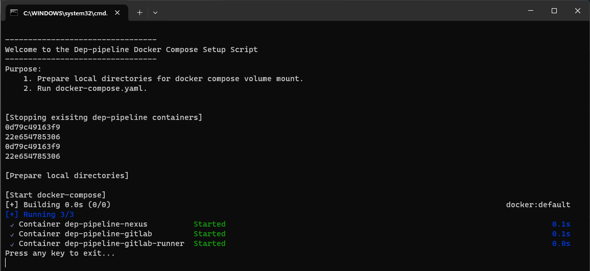
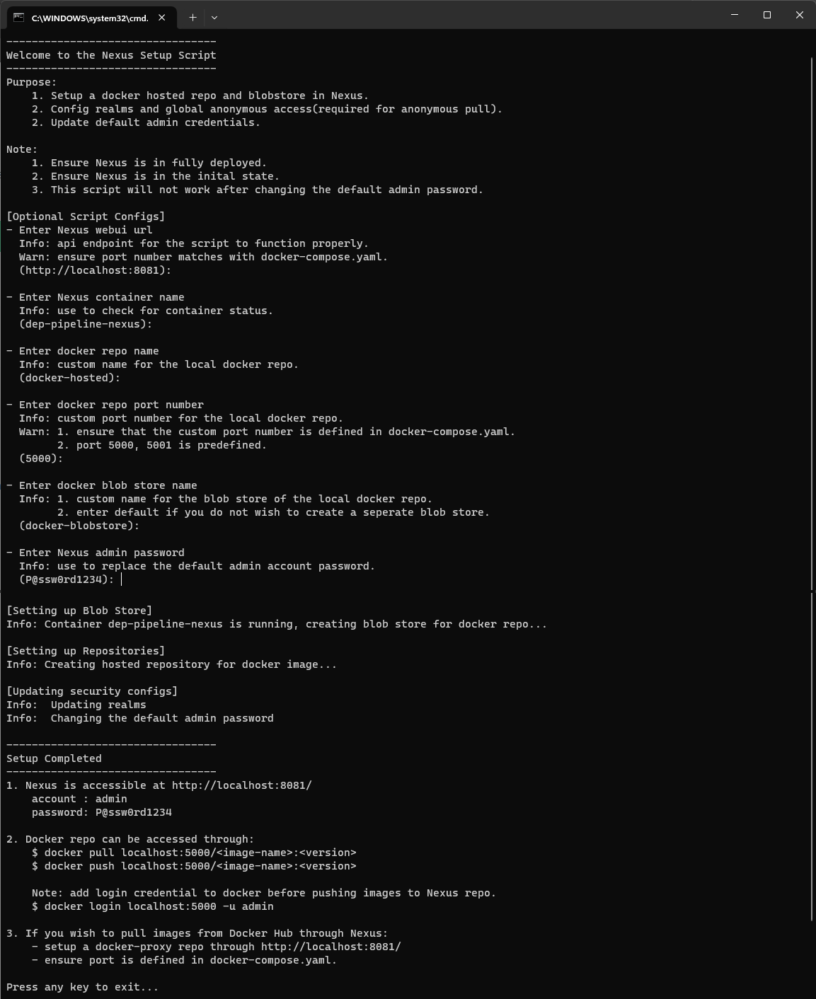
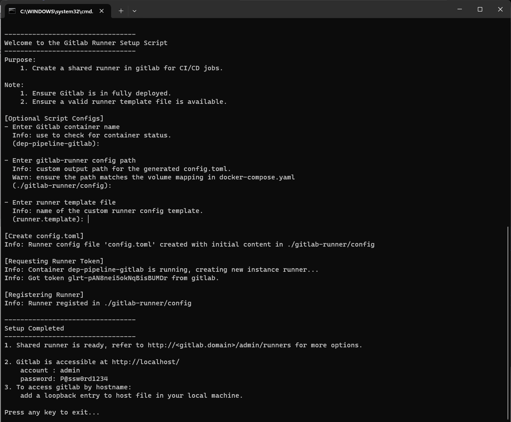
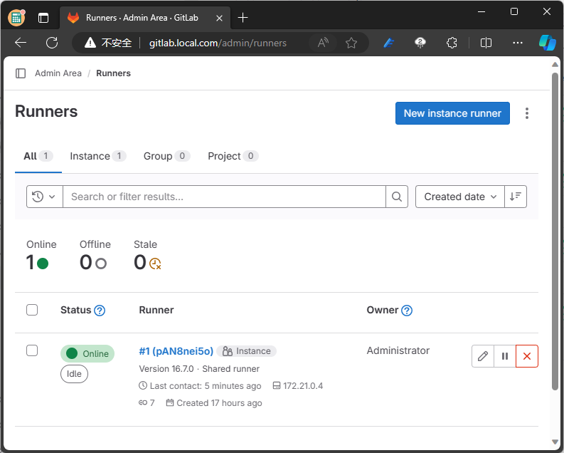

# DEVOPS-IN-A-CONTAINER
Devops-in-a-container is a Docker Compose tool designed to streamline the setup of essential DevOps tools for version control, continuous integration, and dependency management in software development projects. This repository simplifies the process of configuring GitLab Community Edition, GitLab Runner, and Nexus Repository on your local machine/project development server.

## Key Features
- Automated setup of GitLab CE, GitLab Runner, and Nexus Repository using Docker Compose.
- Simplified configuration through included shell scripts, reducing the need for manual intervention.
- Ideal for small project teams and individual developers aiming to establish version control, CI/CD pipelines, and a project dependency repository.

## Target Audience
- Small project teams and individual developers seeking an efficient and easy-to-use solution for DevOps tooling.
- Projects or individuals operating in closed systems, where a self-contained DevOps setup is essential for seamless collaboration.

## Why Devops-in-a-container
In closed network environments, setting up version control, CI/CD pipelines, and library management can be challenging. Devops-in-a-container addresses this by providing an out-of-the-box solution, reducing the effort needed to establish an effective development environment.

# Usage
Follow the instructions in the documentation to quickly deploy and configure `Dep-pipeline` with GitLab CE, GitLab Runner, and Nexus Repository for your software development projects.

Additional Resources:
1. [GitLab-ce, Code Quality & SAST](./GITLAB.md)
1. [GitLab-Runner Template](./RUNNER.md)
1. [Manual set up for Dep-pipeline](./MANUAL.md)

> Note: the pipeline can be resource-heavy, please monitor and adjust the services accordingly.

## Setup Pipeline with Setup Scripts
To speed up the setup process, the following scripts were provided to simplify the configuration procedure.

|Shell scripts |Description |
|----|----|
|setup-docker.sh | Prepares the local directory and starts the containers. |
|setup-nexus.sh  | Creates a docker-hosted repo and configures some basic security options.  |
|setup-runner.sh | Register a shared runner for GitLab CI/CD. | 

> Note: the scripts are meant to initialize a base pipeline with necessary configs to get you started. For additional options, please configure through the respective admin portals.

1. Start Containers
   ```sh
   # run the script
   $ ./setup-docker.sh
   ```
   

   - Ensure `gitlab-runner` and `nexus-data` folders were created for the container.
   - Ensure all containers are running.

2. Setup Nexus  
    > Prerequisite:  
       1. Nexus is fully deployed and the admin portal is accessible before proceeding.  
       2. Default initial password for admin account (admin123).  


    ```sh
    # run the script
    $ ./setup-nexus.sh

    ...
    # optional script configs, leave empty for default values 
    # when using the provided docker-compose.yaml
    [Optional Script Configs]
    - Enter Nexus webui url
      Info: api endpoint for the script to function properly.
      Warn: ensure port number matches with docker-compose.yaml.
      (http://localhost:8081):

    - Enter Nexus container name
      Info: use to check for container status.
      (dep-pipeline-nexus):
    
    - Enter docker repo name
      Info: custom name for the local docker repo.
      (docker-hosted):
    
    - Enter docker repo port number
      Info: custom port number for the local docker repo.
      Warn: 1. ensure that the custom port number is defined in docker-compose.yaml.
            2. port 5000, 5001 is predefined.
      (5000):
    
    - Enter docker blob store name
      Info: 1. custom name for the blob store of the local docker repo.
            2. enter default if you do not wish to create a seperate blob store.
      (docker-blobstore):
    
    - Enter Nexus admin password
      Info: replaces the default admin account password
      (P@ssw0rd1234):
    ```
    
    
    > Note: Global anonymous access is required to enable anonymous pull in respective repository settings. 

3. Setup GitLab Runner  
    > Prerequisite:  
       1. GitLab is fully deployed and the admin portal is accessible before proceeding.  
    
    ```sh
    # run the script
    $ ./setup-runner.sh

    # optional script configs, leave empty for default values 
    # when using the provided docker-compose.yaml
    [Optional Script Configs]
    - Enter GitLab container name
      Info: use to check for container status.
      (dep-pipeline-gitlab):

    - Enter gitlab-runner config path
      Info: custom output path for the generated config.toml.
      Warn: ensure the path matches the volume mapping in docker-compose.yaml
      (./gitlab-runner/config):

    - Enter runner template file
      Info: name of the custom runner config template.
      (runner.template):
    ```
    

    The runner should be online after `gitlab-runner` container reload the `config.toml` file.

    

4. Build and push custom runner image (Optional)
    > Note: The runner is configured to pull a custom alpine image from the local Nexus, please use the `build.sh` script to push the runner-image to Nexus before triggering jobs in GitLab. Otherwise you can change the runner image in `runner.template`. More info [here](RUNNER.md).
    ```
    # login is necessary
    $ docker login localhost:5000 -u admin

    # run the script to build and push the custom image
    $ ./build.sh
    ```

    > Note: Ensure the `runner.template` is valid with `%%TOKEN%%` in the token field. You may amend other options accordingly. More info [here](RUNNER.md).

5. Pushing code to local GitLab
    ```sh
    git remote set-url origin http://<gitlab-hostname>/<group>/<project>.git
    git push --set-upstream origin main
    ```

## Manual Setup
You can set up the services through it's respective admin portals. More info [here](MANUAL.md).

